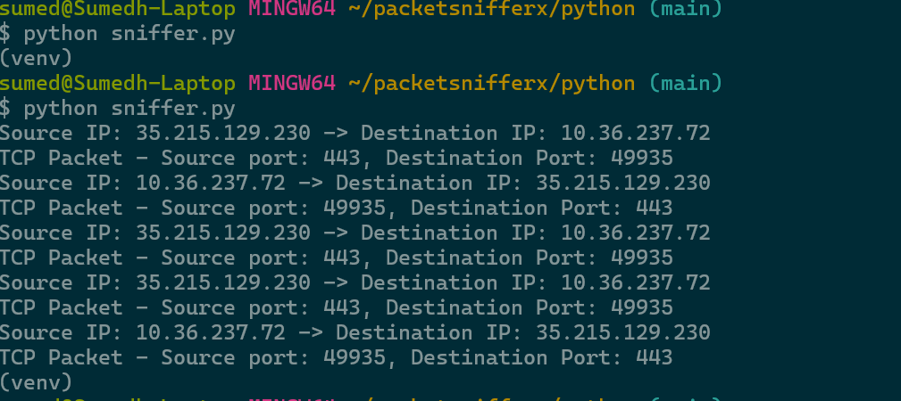

# **PacketSnifferX**

> **Note:** This project is a work in progress. Expect future updates with optimizations and additional features.

### **Current Features**
PacketSnifferX allows you to capture and view network packets, displaying key information such as:
- **Source IP**: Where the packet originated.
- **Destination IP**: The intended recipient of the packet.

### **Screenshot**

Stay tuned for more enhancements!
